<div align="center">



<br /><br />

**Track accounts, categorise transactions, and get intelligent spending insights.**

<br />

   

<br /><br />

**Part of the [InfoDot Ecosystem](https://github.com/sakhileb/InfoDot)** &nbsp;·&nbsp; `finance.infodot.app`

</div>

---

## What is Dot.Finance?

Dot.Finance is the financial management platform in the InfoDot ecosystem. Teams connect their bank accounts and expense streams, and an AI layer automatically categorises transactions, flags anomalies, and generates spend insights — keeping finances transparent and under control.

## Core Features

- Account management — bank, credit, and expense accounts
- Transaction import via CSV or bank sync
- AI categorisation — smart labelling of every transaction
- Budget setup with real-time progress tracking
- Anomaly detection — flagged unusual spend patterns
- P&L and cash-flow reports with chart visualisations
- Invoice reconciliation with Dot.Billing
- Ecosystem SSO from InfoDot hub

## Domain Models

- **Account** — financial account with balance
- **Transaction** — debit or credit entry
- **Budget** — category spend limit with period
- **FinanceCategory** — transaction classification

## Tech Stack

| Layer | Technology |
|---|---|
| Framework | Laravel 12 |
| Language | PHP 8.4 |
| Frontend | Livewire 3 · Alpine.js 3 · Tailwind CSS |
| Database | PostgreSQL 16 (shared across ecosystem) |
| Realtime | Laravel Reverb |
| Auth | Laravel Sanctum (InfoDot SSO) |
| AI | Anthropic Claude (`claude-sonnet-4-6`) |
| Storage | AWS S3 / Local (Flysystem) |
| Search | Laravel Scout · Meilisearch |
| Queue | Redis · Laravel Horizon |

## Quick Start

```bash
git clone https://github.com/sakhileb/Dot.Finance.git
cd Dot.Finance
cp .env.example .env
composer install
npm install && npm run build
php artisan key:generate
php artisan migrate
php artisan serve
```

> **Ecosystem SSO:** Set `DB_*` env vars to the shared InfoDot PostgreSQL instance and `APP_URL=https://finance.infodot.app`. Users authenticated through InfoDot gain access automatically via Sanctum handoff tokens.

## Ecosystem

**Dot.Finance** is one of **21 platforms** in the InfoDot ecosystem, connected via shared PostgreSQL and Sanctum SSO. Visit [InfoDot](https://github.com/sakhileb/InfoDot) to explore the full platform map.

## License

MIT © [SK Digital / BluPin Incorporated](https://github.com/sakhileb)
