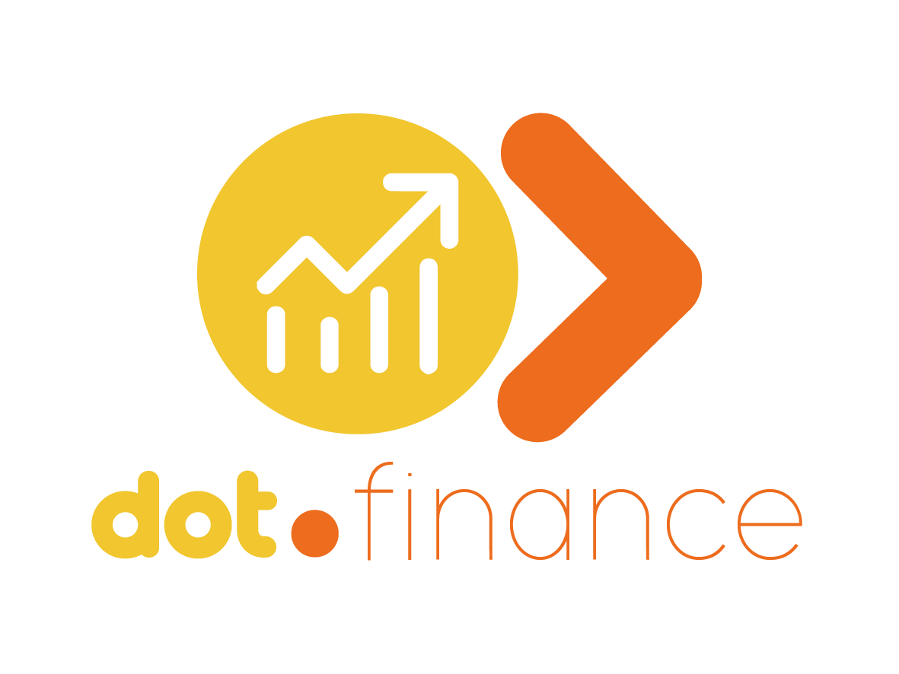

<div align="center">



<h1>Dot.Finance</h1>

<p>AI-powered financial management — track accounts, categorise transactions, set budgets, and get intelligent spending insights.</p>

[](https://php.net)
[](https://laravel.com)
[](https://livewire.laravel.com)
[](https://postgresql.org)
[](tests/)
[](LICENSE)

</div>

---

## Overview

Dot.Finance is the financial management platform in the Dot ecosystem. Connect multiple accounts, automatically categorise transactions, set monthly budgets per category, and receive AI-generated insights on your spending patterns.

---

## Features

- **Multi-account tracking** — bank, credit card, savings, and investment accounts
- **Transaction management** — income and expense records with automatic categorisation
- **Budget tracking** — monthly budgets per category with real-time spent vs. remaining
- **AI insights** — Claude-powered analysis of spending trends and savings recommendations
- **Reporting** — monthly summaries, category breakdowns, net worth over time
- **Team/business mode** — shared accounts for business financial management
- **Ecosystem SSO** — authenticate from InfoDot with a single click

---

## Domain Model

```
Account     → Transactions → Category
Category    → Transactions
Budget      → Category (monthly target, spentAmount() computed)
AiInsight   → User
```

---

## Tech Stack

| Layer | Technology |
|---|---|
| Framework | Laravel 12 + PHP 8.4 |
| Frontend | Livewire 3 + Alpine.js + Tailwind CSS |
| Auth | Jetstream 5 + Sanctum (ecosystem SSO) |
| Database | PostgreSQL 16 (shared infodot instance) |
| AI | Anthropic Claude API |
| WebSockets | Laravel Reverb |

---

## Quick Start

```bash
git clone https://github.com/sakhileb/Dot.Finance.git && cd Dot.Finance
composer install && npm install
cp .env.example .env && php artisan key:generate
php artisan migrate && npm run dev & php artisan serve
```

```bash
bash bin/test.sh   # 37 passing, 0 failed, 7 skipped
```

---

## Part of the Dot Ecosystem

Dot.Finance connects to [InfoDot](https://github.com/sakhileb/InfoDot) — the central hub. Log in to InfoDot once and navigate here without re-authenticating via `/auth/ecosystem`.

---

MIT — © SK Digital / BluPin Incorporated
